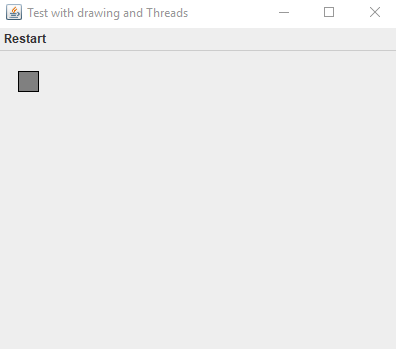

This is simple Java program was written by me for the purpose of learning by doing.
I was interested to try develop a program and to play around with Java Thread class.
When started this program allows you to chose three options.
The 1st option will cause to start program with moving colored block across the Frame. 

The 2nd option is interesting and worth mention here because i wanted to write a demo program where the moving block will change it's color to another.
This block moves not fast because i implemented another program program logic here. I wanted to achive the the result when one Thread (moving Thread here) awaits another Thread (a thread that changes color) for awhile, while it not finished it's work.

This idea to write this demo (2nd option to choose) came on my mind when i was writing a game named Columns. There was a situation when user drops blocks with colors, and the colors happened to be similar. It is a normal game workflow. I wanted to let the main Thread (a Thread that is responsible for game cycles) to wait another thread, which will display blocks with similar colors by filling them certain some color. This will let the player see which blocks are going to be removed. So i wrote this demo program, to see how to achieve this. 

The 3rd option will cause running the program displaying block running across the Frame. The block is changing it's background to three diferent colors in cycle while moving across the Frame.

The screenshot shows the 3rd option running.

Это простая Java-программа, написанная мной с целью обучения.
Мне было интересно попробовать разработать программу и "поиграть" с классом Java Thread.
При запуске этой программы вы можете выбрать три варианта.

1й вариант приведет к запуску программы с перемещением цветного блока по кадру. 

2й вариант интересен и стоит того, чтобы его здесь упомянули отдельно, Потому что я хотел написать демо-программу, 
в которой движущийся блок будет менять свой цвет на другой. Этот блок движется не быстро, потому что здесь я реализовал другую логику программы. Я хотел достигнуть результата, когда один поток 
(здесь Thread отвечающий за движение) ждет другой Thread (поток, который меняет цвет) некоторое время, пока тот не завершил работу.

Эта идея написать эту демонстрацию (второй вариант для выбора) возникла у меня в голове, когда я писал игру под названием Columns. 
Была ситуация, когда пользователь бросает блоки с цветами, а цвета оказываются похожими. Это нормальный игровой процесс. Я хотел, чтобы 
главный Thread (Thread, отвечающий за игровые циклы) подождал другой поток, который будет отображать блоки с одинаковыми цветами, 
заполняя их определенным цветом. Это позволит игроку увидеть, какие блоки будут удалены. Поэтому я написал эту демо-программу, 
чтобы узнать, как этого достичь. 

3й вариант приведет к запуску программы, отображающей блок, проходящий через Frame. Блок меняет фон на три разных цвета в цикле, 
перемещаясь по рамке.

Скриншот показывает работу после выбора 3

